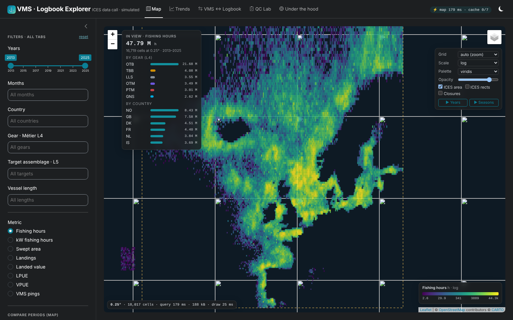

# ICES VMS · Logbook Explorer

A Dockerised Shiny app (bslib + Leaflet) for exploring an **ICES-wide** VMS
(Table 1) and logbook (Table 2) data call store — simulated, but laid out and
sized the way the ICES total could realistically be held: 18 countries,
13 years, ~7.8 M Table 1 rows and ~5.3 M Table 2 rows by default.

```bash
cp .env.example .env                       # add your CARTO basemap key (see Configuration)
docker compose up --build                  # simulates data + builds cubes (~10 min)
# open http://localhost:3838
```

or without Compose:

```bash
docker build -t ices-vms-explorer .
docker run --rm -p 3838:3838 -e CARTO_BASEMAP_KEY=your-key ices-vms-explorer
```

Scale the data with `--build-arg ROWS_PER_YEAR=2000000` (rows of Table 1 per
year, all countries). The app runs without a CARTO key, but the Dark/Light
basemaps are then watermarked.



<sub>Screenshots were taken offline, so the basemap tiles are blank; in a normal browser the Esri Ocean / Carto basemaps load underneath. More: [compare](docs/compare.png) · [VMS ↔ logbook](docs/logbook.png) · [QC Lab](docs/qc.png)</sub>

## What you can do with it

| Tab | What it gives you |
|---|---|
| **Map** | Every c-square in the ICES area on a canvas layer. Resolution follows zoom (1° → 0.05°). Hover for values, click a cell to drill into the raw Table 1 rows (year × gear history, seasonality, top métiers, countries, depth, habitat, share of rows with < 3 vessels). A live *In view* panel summarises whatever is on screen by gear and country. |
| ↳ Compare periods | Switch on in the sidebar: selected years minus a baseline (absolute per-year change or % change) on a diverging scale. Wind-farm and bottom-gear closures and the north-westward drift of the pelagic fleet show up immediately. |
| ↳ Time-lapse | **▶ Years** / **▶ Seasons** fetch all frames in one query and animate them in the browser on a fixed colour scale. |
| ↳ Overlays | ICES data call area (44°W–30°E, 35–90°N), ICES rectangle grid with codes, closure polygons. Palette, scale (log / quantile / linear) and opacity are pure client-side. |
| **Trends** | KPI cards with sparklines, stacked time series by gear / country / target / length class (or 100 % shares), year × month seasonality heatmap, **spatial footprint index** (c-squares holding 50 % / 90 % of effort), LPUE by gear, country × gear matrix, biggest-moving ICES rectangles, and auto-generated insights. |
| **VMS ↔ Logbook** | Table 2 mapped by rectangle, including *VMS ÷ logbook landings* and *effort not VMS-enabled*. Effort invisible to VMS by vessel length, rectangle-level scatter of VMS vs logbook landings, country reconciliation table, and a per-rectangle history on click. |
| **QC Lab** | Runs the ICES reviewer checklist for one country straight from the lake: ICES area, fishing speeds by gear vs plausible ranges, seines centred near zero, gear width units, vessel lengths and length classes, VMS intervals, value submitted, discontinuities, kW × hours consistency, Table 1 ↔ Table 2 landings, DATSU rectangle codes. Gives a verdict (*Approved / with conditions / Rejected*) and a downloadable findings CSV in the reviewer-form shape. |
| **Under the hood** | Storage layout, live query log (ms, rows, cache hits), and a read-only DuckDB SQL console over the lake and cubes. |

All global filters (years, months, country, gear L4, target L5, vessel length,
metric) apply across Map, Trends and VMS ↔ Logbook.

## How it stays fast

```
 Parquet lake (cold)            DuckDB cubes (hot)                Browser
 lake/vms/Year=YYYY/            cube_1   0.05° (c-square)         one <canvas>
   CountryCode=XX/              cube_5   0.25°                    base64 Int16/Float32 arrays
   part-0.parquet               cube_10  0.5°          ──────►    colour scale on the client
 Morton-sorted, 8k row groups   cube_20  1°                       time-lapse animated locally
 zstd + dictionary              cube_ts  no space (charts)
                                le_cube / vms_rect (reconciliation)
```

* **One folder per national submission** (`Year=/CountryCode=`): a resubmission
  replaces exactly one folder, and year/country filters skip files — the QC Lab
  reads 13 of 234 files for one country.
* **Z-order (Morton) sorting** on the c-square grid inside each file with small
  row groups, so a bounding-box query only decompresses row groups that can
  overlap it. Grid indices and centroids are materialised at ingest, so nothing
  parses C-square strings at query time.
* **Cube pyramid.** The map asks for the level whose cells are ~2.5+ px wide.
  A whole-ICES view scans the 0.25° cube; 0.1° is rolled up from the 0.05° cube
  on the fly, and only for the padded viewport. Dimensions are ENUMs (1 byte).
* **Binary transport.** Cells go to the browser as base64 typed arrays, not
  GeoJSON: 150k cells ≈ 1.6 MB.
* **Canvas renderer** (`app/www/csquare-layer.js`): cells batched by colour bin,
  web-mercator rows cached, so 150k+ cells draw in ~10–40 ms. Palette, scale and
  opacity never round-trip to R.
* **Caching.** Every query is memoised in an LRU cache keyed on its SQL
  (`CACHE_MB`), and panning inside an already-loaded area does not query at all.
* **Single-scan drill-down.** A cell click is one `GROUPING SETS` query over the
  lake that returns every breakdown at once.

Measured in the dev sandbox (2 vCPU, cold cache): whole-area map 35–180 ms,
0.05° zoomed view (156k cells) 61 ms query + 15 ms draw, time-lapse of 13 years
39 ms, cell drill-down 150–250 ms, full QC run 0.3–2 s. Cached repeats are ~0 ms.

## The simulated data

`sim/simulate.py` writes Table 1 and Table 2 with the exact field names of the
national submission script (`table1Save` / `table2Save`). It is built to *look*
like the real thing:

* 17 métiers (OTB, TBB, OTM, PTM, PS, SDN, SSC, DRB, LLS, GNS, FPO) on ~40 named
  fishing grounds, depth-preference windows per gear, patchy heavy-tailed
  effort, Nephrops on mud, home-port ranges per country and gear.
* Land mask, a synthetic bathymetry and MSFD broad habitat types.
* Country VMS ping intervals and thresholds (Norway ≥ 15 m, EU ≥ 12 m), so small
  vessels exist only in the logbook (`VMSEnabled = N`), ~6 % of trips fail to
  link and ~14 % of logbook rectangles differ from the VMS position.
* Storylines: Baltic cod closure (2020), beam-trawl decline, COVID dip
  (spring 2020), offshore wind farms and a Dogger Bank-like bottom-gear closure,
  a north-westward drift of the pelagic fleet, Brexit-like redistribution.
* **Deliberately injected QC problems**, mirroring a real reviewer report:
  Norwegian gear widths in metres and steaming speeds, Danish kWh ×10 in 2021,
  French value missing in 2019, Spanish positions in NAFO in 2024, Portuguese
  lengths in feet in 2023, Irish intervals in minutes in 2017. The QC Lab finds
  all of them; *Under the hood* lists them.

## Using real submissions

```bash
Rscript sim/ingest_submission.R --table1 table1Save.csv --table2 table2Save.csv --out data
Rscript sim/build_warehouse.R data
CARTO_BASEMAP_KEY=your-key DATA_DIR=$PWD/data Rscript -e "shiny::runApp('app', port = 3838)"
```

Instead of prefixing the command you can put `CARTO_BASEMAP_KEY=...` in an
`.Renviron` file in the project folder (it is git-ignored).

The ingest script decodes C-squares to centroids/grid indices/ICES rectangles,
Morton-sorts and writes the same lake layout (CSV or the `.rds` outputs both
work; pass several files comma-separated). It reads CSVs as text first — DuckDB's
sniffer would otherwise turn the country code `NO` into a boolean. To bake real
data into the image, replace the `data` stage in the Dockerfile with a `COPY` of
your lake.

## Configuration

| Env var | Default | |
|---|---|---|
| `DATA_DIR` | `/data` | folder holding `lake/` and `warehouse.duckdb` |
| `DUCKDB_THREADS` | all cores | |
| `DUCKDB_MEMORY` | `2GB` | DuckDB memory limit |
| `CACHE_MB` | `512` | result cache size |
| `SQL_CONSOLE` | `true` | set `false` to hide the console |
| `CARTO_BASEMAP_KEY` | – | free CARTO basemap key ([carto.com/basemaps/apikey](https://carto.com/basemaps/apikey)); without it the Dark/Light basemaps are watermarked |

The SQL console runs on a DuckDB connection with `enable_external_access = false`,
`allowed_directories` limited to the data folder, and a locked configuration.

### The CARTO basemap key

The key is passed in at **run time** and never committed or built into the image:

* **Docker Compose** reads it from `.env` next to `docker-compose.yml`
  (copy `.env.example` to `.env` and fill it in). `.env` is listed in
  `.gitignore` and `.dockerignore`.
* **`docker run`**: `-e CARTO_BASEMAP_KEY=...`.
* **Local R**: `.Renviron` or a prefix on the command, as above.

Do not set it with `ENV` or `ARG` in the Dockerfile: both end up in the image
(`ARG` values are visible in `docker history`).

The key is not a secret in the strict sense — it appears in the tile URLs the
browser requests — but keeping it out of the repository protects your quota
(free tier: 5 million tile requests a month). If a key ends up in git, create a
new one and deactivate the old one on the CARTO basemaps dashboard; removing it
from the code alone is not enough, since it stays in the history. CARTO and
OpenStreetMap attribution must stay on the map.

## Layout

```
Dockerfile, docker-compose.yml
.env.example               template for .env (CARTO_BASEMAP_KEY)
sim/simulate.py            Parquet lake generator (stage 1)
sim/build_warehouse.R      cube pyramid + dimension tables (stage 2)
sim/ingest_submission.R    real table1Save / table2Save -> lake
app/app.R                  page_navbar, global filters
app/R/db.R                 DuckDB connection, cache, query log, SQL helpers
app/R/mod_*.R              map, trends, logbook, qc, about modules
app/www/csquare-layer.js   canvas grid layer, legend, controls, time-lapse player
app/www/app.css
```

Concurrency: one R process serves many users, but queries run synchronously.
For a larger audience run several containers behind a load balancer (the
warehouse is opened read-only, so they can share one volume).